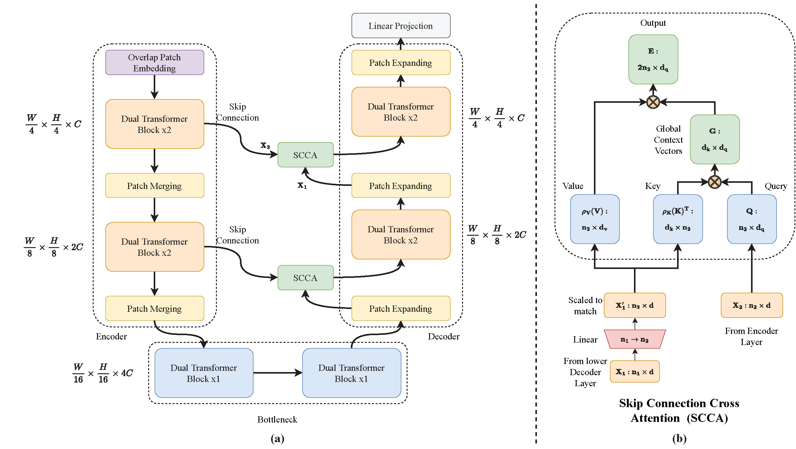

# [DAE-Former: Dual Attention-guided Efficient Transformer for Medical Image Segmentation - MICCAI 2023 PRIME Workshop](https://arxiv.org/abs/2212.13504)

Transformers have recently gained attention in the computer vision domain due to their ability to model long-range dependencies. However, the self-attention mechanism, which is the core part of the Transformer model, usually suffers from quadratic computational complexity with respect to the number of tokens. Many architectures attempt to reduce model complexity by limiting the self-attention mechanism to local regions or by redesigning the tokenization process. In this paper, we propose DAE-Former, a novel method that seeks to provide an alternative perspective by efficiently designing the self-attention mechanism. More specifically, we reformulate the self-attention mechanism to capture both spatial and channel relations across the whole feature dimension while staying computationally efficient. Furthermore, we redesign the skip connection path by including the cross-attention module to ensure the feature reusability and enhance the localization power. Our method outperforms state-of-the-art methods on multi-organ cardiac and skin lesion segmentation datasets, without pre-training weights.



## Updates

- July 25, 2023, 2022: Accepted in MICCAI 2023 PRIME Workshop! 🥳
- December 29, 2022: Initial release with arXiv.

## Citation
```
@article{azad2022daeformer,
  title={DAE-Former: Dual Attention-guided Efficient Transformer for Medical Image Segmentation},
  author={Azad, Reza and Arimond, René and Aghdam, Ehsan Khodapanah and Kazerouni, Amirhosein and Merhof, Dorit},
  journal={arXiv preprint arXiv:2212.13504},
  year={2022}
}
```

## How to use

The script train.py contains all the necessary steps for training the network. A list and dataloader for the Synapse dataset are also included.
To load a network, use the --module argument when running the train script (``--module <directory>.<module_name>.<class_name>``, e.g. ``--module networks.DAEFormer.DAEFormer``)


### Model weights
You can download the learned weights of the DAEFormer in the following table. 

Task | Dataset |Learned weights
------------ | -------------|----
Multi organ segmentation | [Synapse](https://drive.google.com/uc?export=download&id=18I9JHH_i0uuEDg-N6d7bfMdf7Ut6bhBi) | [DAE-Former](https://drive.google.com/u/0/uc?id=1JEnicYtcMbU_PD_ujCPMaOH5_cs56EIO&export=download)


### Training and Testing

1) Download the Synapse dataset from [here](https://drive.google.com/uc?export=download&id=18I9JHH_i0uuEDg-N6d7bfMdf7Ut6bhBi).

2) Run the following code to install the Requirements.

    `pip install -r requirements.txt`

3) Run the below code to train the DAEFormer on the synapse dataset.
    ```bash
    python train.py --root_path ./data/Synapse/train_npz --test_path ./data/Synapse/test_vol_h5 --batch_size 20 --eval_interval 20 --max_epochs 400 --module networks.DAEFormer.DAEFormer
    ```
    **--root_path**     [Train data path]

    **--test_path**     [Test data path]

    **--eval_interval** [Evaluation epoch]

    **--module**        [Module name, including path (can also train your own models)]
    
 4) Run the below code to test the DAEFormer on the synapse dataset.
    ```bash
    python test.py --volume_path ./data/Synapse/ --output_dir './model_out'
    ```
    **--volume_path**   [Root dir of the test data]
        
    **--output_dir**    [Directory of your learned weights]
    
## Results
Performance comparision on Synapse Multi-Organ Segmentation dataset.


### Query
All implementation done by Rene Arimond. For any query please contact us for more information.

```python
rene.arimond@lfb.rwth-aachen.de

```
